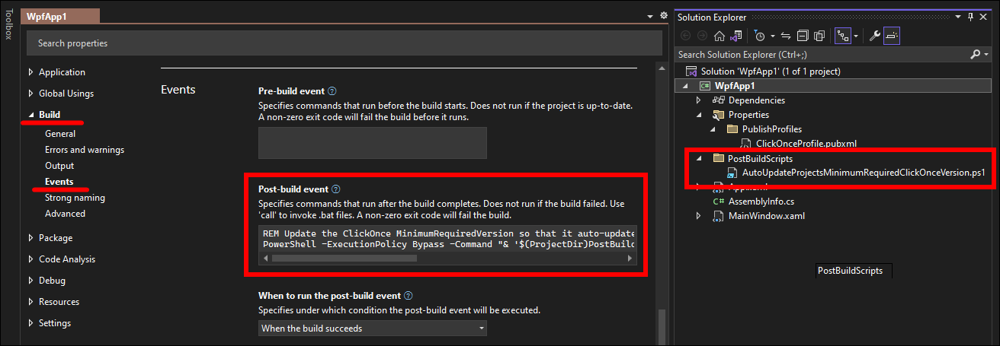

# 💬 Project Description

Automatically force your ClickOnce app to update itself without prompting the user; this is less obtrusive to the user experience when receiving updates, and enhances security by ensuring the latest version is always used.

This is a PowerShell script that updates the ClickOnce application's minimum required version to the latest published version.
This will eliminate the prompt that asks the user if they want to download and install the latest version; instead the update will automatically be downloaded and installed.

## 💿 Installation

The installation instructions below are intended to be used when publishing your ClickOnce app from Visual Studio.
If you are looking to publish your ClickOnce app from a CI/CD pipeline, check out [this blog post](https://blog.danskingdom.com/continuously-deploy-your-clickonce-application-from-your-build-server/).

### .NET Framework Project and Packages.config Installation

If you are using a .NET Framework project, as well as the `packages.config` package management format, simply install the [AutoUpdateProjectsMinimumRequiredClickOnceVersion NuGet package](https://nuget.org/packages/AutoUpdateProjectsMinimumRequiredClickOnceVersion) to your project, and it will automatically handle all of the installation for you.

> NOTE: If you are using the PackageReference NuGet package management format, you will need to follow the manual installation instructions in the following section below.


As you can see in the last screenshot above, the NuGet package will add a `PostBuildScripts` folder to your project that contains the AutoUpdateProjectsMinimumRequiredClickOnceVersion.ps1 PowerShell script that is ran after each build.
It also update's the project file to add a post-build event to run the PowerShell script.

### .NET Core Project / PackageReference Installation (e.g. .NET Core 3.1, .NET 5, .NET 6, etc.)

.NET Core projects use the PackageReference NuGet package management format, where NuGet package references are stored directly in the project file instead of a separate `packages.config` file.
Unfortunately the PackageReference format does not support NuGet packages running scripts during installation, so it cannot automatically add the required post-build event to the project.

Instead of using the NuGet package, you will instead need to manually add the PowerShell script to your project, and add the post-build event to the project file.
The steps to do this are:

1. In Visual Studio, right-click on your project and add a new folder called `PostBuildEvents`.
1. Download [the AutoUpdateProjectsMinimumRequiredClickOnceVersion.ps1 PowerShell script](src/AutoUpdateProjectsMinimumRequiredClickOnceVersion.ps1) and save it to the `PostBuildEvents` folder.
1. You should now see the PowerShell script in the `PostBuildEvents` folder in Solution Explorer.
   1. If you do not see the PowerShell file in Visual Studio, right-click on the `PostBuildEvents` folder and choose `Add` > `Existing Item...`.
   Select the PowerShell script that you downloaded and saved to the `PostBuildEvents` folder.
1. In Visual Studio, right-click on the project and choose `Properties`.
1. Navigate to the `Build` > `Events` tab, and paste the following code into the `Post-build event` text box:

   ```cmd
   REM Update the ClickOnce MinimumRequiredVersion so that it auto-updates without prompting.
   PowerShell -ExecutionPolicy Bypass -Command "& '$(ProjectDir)PostBuildScripts\AutoUpdateProjectsMinimumRequiredClickOnceVersion.ps1' -ProjectFilePaths '$(ProjectPath)'"
   ```

The end result should look like this:



If you have multiple projects that you deploy via ClickOnce, you'll want to do the steps above for each project.

## ⚒ Additional ClickOnce Setup

After the installation, if you haven't published your ClickOnce app yet, when you build your project it may fail with an error like:

> `MSB3073` PowerShell script exited with code 1.

If you check the `Output` pane in Visual Studio, it may mention that your project does not have any ClickOnce deployment settings in it.
Before the build will succeed, you need to configure those settings.

### .NET Framework Project ClickOnce Settings

.NET Framework projects store their ClickOnce settings in the project file.
To configure the settings:

1. You can access the project settings by right-clicking the project in Visual Studio and choosing `Properties`.
1. In the project properties, on the `Publish` tab, in the `Updates...` button, make sure the following options are checked:
   1. The application should check for updates
   1. Specify a minimum required version for this application

   

### .NET Core Project ClickOnce Settings

.NET Core projects store their ClickOnce settings in a publish profile xml file.
To configure the settings:

1. You can edit the publish profile settings by right-clicking the project in Visual Studio and choosing `Publish...` to get to the wizard.
1. If you have multiple publish profiles, choose the appropriate ClickOnce profile, or create a new one.
1. In the Publish wizard, within the `Settings` tab, make sure the following options are checked:
   1. The application should check for updates
   1. In the `Update Settings` window, Specify a minimum required version for this application

   

## 🤔 Troubleshooting

If for some reason the script is not updating your project's MinimumRequiredVersion to the latest published version, check the Visual Studio `Output` window for error messages thrown by the PowerShell script.

## 📃 Manually Running The PowerShell Script

Detailed help documentation for manually running [the PowerShell script](/src/AutoUpdateProjectsMinimumRequiredClickOnceVersion.ps1) can be obtained by running the Get-Help cmdlet against the script in a PowerShell window.

For example, open up a Windows PowerShell command prompt, navigate to the folder containing the AutoUpdateProjectsMinimumRequiredClickOnceVersion.ps1 script, and enter:

```powershell
Get-Help .\AutoUpdateProjectsMinimumRequiredClickOnceVersion.ps1 -Detailed
```

## 😎 Tips

The first build after each ClickOnce deployment will update the .csproj file, and the project will need to be reloaded.
If you are running an older version of Visual Studio (2012 or earlier), to prevent the reloading of the project from closing any tabs that you have open I recommend installing the [Workspace Reloader Visual Studio extension](http://visualstudiogallery.msdn.microsoft.com/6705affd-ca37-4445-9693-f3d680c92f38).

## 💳 Donate

Buy me a hot chocolate for providing this project open source and for free 🙂

[](https://www.paypal.com/cgi-bin/webscr?cmd=_s-xclick&hosted_button_id=8Y2HFLM7G5LJY)
